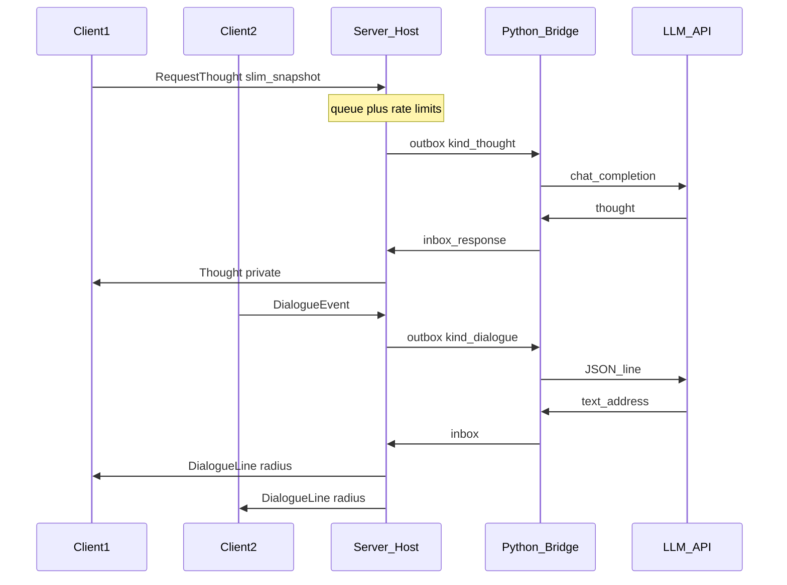

# AI Thoughts — Multiplayer Design (Mode B)

**Build 42 only** (`versionMin=42.13.0`). See [B42.md](B42.md).

**Decision: Mode B — server-proxy LLM, host pays.**

- **Thoughts** are private (sticky only for the requester).
- **Dialogues** are spoken nearby, turn-based (see [DIALOGUE.md](DIALOGUE.md)).

## Why Mode B

- One API key / one bridge on the **host or dedicated server**.
- Clients do not run Python or hold secrets.
- Host pays for thought and dialogue LLM jobs.

## Architecture

## Folder layout

| Path | Role |
|------|------|
| `shared/` | Config, Catalog, Prompts, Pacing, Sandbox, Net, Dialogue, Memory |
| `client/` | Sensors, pacing, DialogueClient, sticky UI |
| `server/` | Thought queue + DialogueDirector, host bridge IO |

## Protocol (`module = DSThoughts`)

| Direction | Command | Args |
|-----------|---------|------|
| C→S | `RequestThought` | slim snapshot (schema 4) |
| S→one | `Thought` | `{ request_id, thought, speaker, private }` |
| S→one | `ThoughtError` | `{ request_id, error }` |
| C→S | `DialogueEvent` | slim trigger + nearby (schema 5) |
| S→near | `DialogueLine` | spoken line + address + attracts_zombies |
| S→near | `DialogueEnded` | `{ session_id, reason }` |

Server overwrites `prompts.world_main` from `DialogueMain` or `WorldMain` by `kind`.

## Rate / cost

- Global cooldown ~8s between LLM jobs (single outbox).
- Dialogue queue **priority** over thoughts.
- Per player: max 12 requests / 10 minutes.
- Dialogue: max ~6 turns/session + group cooloff ~4 min.
- Thoughts suppressed during active dialogue except panic spikes.

## Privacy / display

- Thoughts: private sticky (cool blue). Think Aloud optional.
- Dialogues: warm subtitle + optional Say/world sound.

## Dedicated vs listen-server

- **Listen host**: Bridge Launcher on host PC.
- **Dedicated**: bridge on server machine under `Zomboid/Lua/DeepSeekThoughts/`.

## Non-goals

- Client-side API keys in MP.
- Syncing full situation tables.
- Everyone answering the same beat at once.
